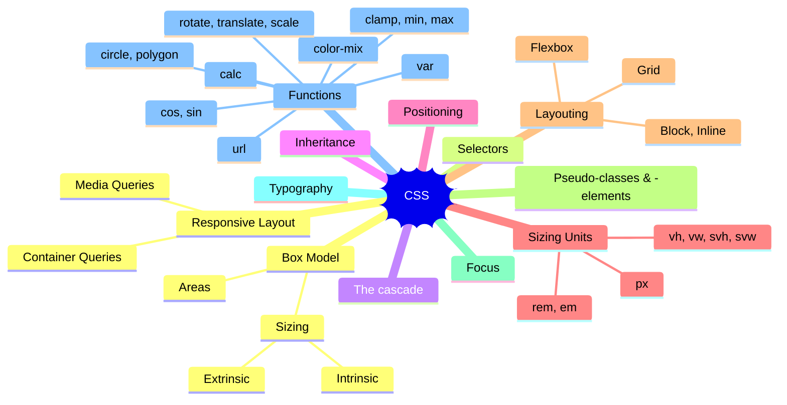

# Web Dev 101

Every web developer should know!

[@kdenerz](https://x.com/kdenerz)

---
layout: default
---

# About
## Konstantin Denerz

* Consultant@Thinktecture
* \>20yrs exp (.NET, Java, Web ❤️, ...)
* Focus 🔥
    * Frontend Dev with 🅰️ngular
    * UX⚡️UI & Design Systems
    * [CSS Experiments 🧪](https://codepen.io/konstantindenerz) @CodePen
* Follow me on X[@kdenerz](https://x.com/kdenerz)
* Customer Projects: { Consulting, Coaching, Development, Design}

---
layout: image
image: './images/demos.png'
---

---
layout: center
---

# Why Web Dev 101? 🤔

---
layout: center
---

| **Tech Stack - Frontend**          |
|------------------------------------|
| ⚡️️  ~~Tailwind CSS, Flex Layout~~ |
| ⚡️️  Dev Extreme                   |
| ⚡️️  Angular Material              |
| ⚡️️  CDK                           |
| ⚡️️  NgRx                          |
| ⚡️️  Angular                       |
| ⚡️️  SCSS                          |
| 😍 Browser API (JS / CSS)          |

<!-- 
* Reduce complexity
* Some frameworks are not necessary,
if you knows the native API (JS / CSS)

* CSS Anchor API (Experimental) for e.g. Tooltips
* Native Layouting with CSS instead of *Angular Flex Layout*
* CSS - Custom Functions and Mixins
  https://github.com/w3c/csswg-drafts/issues/9350
=> caniuse
-->

---
layout: default
---

https://web.dev/learn/css

<!--

-->

---
layout: center
---

# Use Case: Card with Hover-State

<iframe style="border: 1px solid rgba(0, 0, 0, 0.1);" width="800" height="450" src="https://www.figma.com/embed?embed_host=share&url=https%3A%2F%2Fwww.figma.com%2Ffile%2F2gMwcPm48wTBmxqcDSv4uX%2Fweb-dev-101%3Ftype%3Ddesign%26node-id%3D54795%253A26730%26mode%3Ddev" allowfullscreen></iframe>

<!-- 
* Use border-radius: inherits; for card image
* Reduce emphasis with :nth-child() (Pseudo-classes)
* Var()
* Flexbox, column gap
* Padding
* Border
* Hover @support(hover){}
-->

---
layout: center
---

# CodePens: web-dev-101

https://codepen.io/collection/LPaymk/84c4201082f6130271ceadda115a8124

---
layout: center
---

# Use Case: Dashboard With Cards

<iframe style="border: 1px solid rgba(0, 0, 0, 0.1);" width="800" height="450" src="https://www.figma.com/embed?embed_host=share&url=https%3A%2F%2Fwww.figma.com%2Ffile%2F2gMwcPm48wTBmxqcDSv4uX%2Fweb-dev-101%3Ftype%3Ddesign%26node-id%3D54889%253A26811%26mode%3Ddesign%26t%3DcCOx05h9K4EGMgvH-1" allowfullscreen></iframe>

<!-- 
* Overflow: Hidden Auto
* Grid
  * Columns 1fr
  * Gap
* App Bar
  * flex, 3 flex (flex start, end, center)
    * flex-grow
* FAB 
  position: sticky
-->

---
layout: center
---

# Use Case: Responsive Layout

<iframe style="border: 1px solid rgba(0, 0, 0, 0.1);" width="800" height="450" src="https://www.figma.com/embed?embed_host=share&url=https%3A%2F%2Fwww.figma.com%2Ffile%2F2gMwcPm48wTBmxqcDSv4uX%2Fweb-dev-101%3Ftype%3Ddesign%26node-id%3D55181%253A238%26mode%3Ddesign%26t%3Djq2O8BR305kzKoHg-1" allowfullscreen></iframe>

<!-- 
* Grid
* Container Queries
-->

