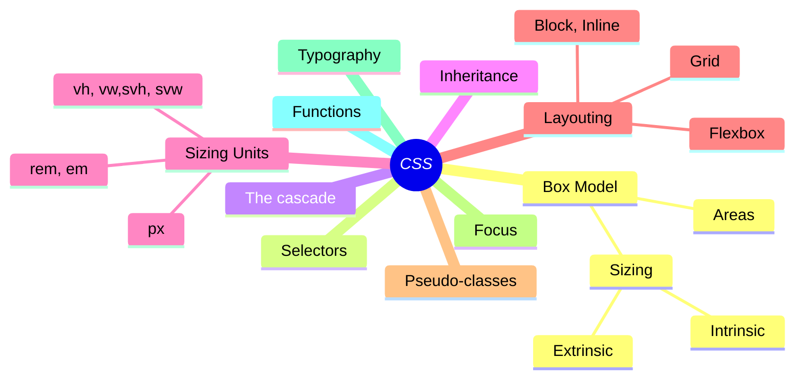

# Web Dev 101

Every web developer should know!

[@kdenerz](https://x.com/kdenerz)

---
layout: default
---

# Konstantin Denerz

* Consultant@Thinktecture
* \>20yrs exp (.NET, Java, Web ❤️, ...)
* Focus 🔥
    * Frontend Dev with 🅰️ngular
    * UX⚡️UI & Design Systems
    * [CSS Experiments 🧪](https://codepen.io/konstantindenerz) @CodePen
* Follow me on X[@kdenerz](https://x.com/kdenerz)
* Customer Projects: { Consulting, Coaching, Development, Design}

---
layout: center
---

# Why Web Dev 101? 🤔

---
layout: center
---

| **Tech Stack - Frontend**          |
|------------------------------------|
| ⚡️️  ~~Tailwind CSS, Flex Layout~~ |
| ⚡️️  Dev Extreme                   |
| ⚡️️  Angular Material              |
| ⚡️️  CDK                           |
| ⚡️️  NgRx                          |
| ⚡️️  Angular                       |
| ⚡️️  SCSS                          |
| 😍 Browser API (JS / CSS)          |

<!-- 
* Reduce complexity
* Some frameworks are not necessary,
if you knows the native API (JS / CSS)

* CSS Anchor API (Experimental) for e.g. Tooltips
* Native Layouting with CSS instead of *Angular Flex Layout*
-->

---
layout: default
---

https://web.dev/learn/css

<!--
Let's take a look at Box Model
-->
